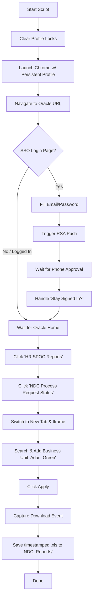

# Oracle Fusion - NDC Process Request Status Report Downloader

This project automates the extraction and download of the Oracle BI Publisher report: **`NDC Process Request Status(NDC Assigned Date)`**.

It utilizes **Playwright** in Python to handle the navigation, automate Microsoft SSO login, manage MFA/RSA push notifications, select the target Business Unit, and download the report file.

---

## Features

- **Automated Authentication**: Automatically fills email and password credentials for Microsoft SSO.
- **MFA/RSA Push Handling**: Detects MFA requests and prompts the user to approve the push notification on their phone.
- **Session Persistence**: Saves the browser session state in `chrome_automation_profile/` so that subsequent runs do not require logging in or completing MFA again until the session expires.
- **Dynamic UI Navigation**: Handles Oracle Fusion springboard, handles nested BI Publisher iFrames, searches and assigns Business Units (e.g., `Adani Green`), and triggers automated Excel downloads.
- **Smart Retries & Error Handling**: Implements retry logic for SSO pages and automatically clears Chrome lock files before starting.

---

## File Structure

- `download_ndc_report.py` - The main automation script.
- `pyproject.toml` - Defines dependencies (Playwright, python-dotenv, psutil).
- `uv.lock` - Lockfile for dependency management.
- `.env` - Contains Oracle URLs and user credentials (git-ignored).
- `.env.sample` - Template for configuring environment variables.
- `chrome_automation_profile/` - Directory storing the persistent Chrome user profile and session data.
- `NDC_Reports/` - Output directory where downloaded Excel reports (`.xls`) are saved.

---

## Prerequisites

1. **Python 3.12+**
2. **Google Chrome** installed on the host machine (the script uses the official Chrome channel for automation).
3. **[uv](https://github.com/astral-sh/uv)** (recommended Python package manager) or standard `pip`.

---

## Setup & Installation

### Step 1: Configure Environment Variables
Copy `.env.sample` to a new file named `.env`:
```powershell
copy .env.sample .env
```
Open `.env` and fill in your details:
- `ORACLE_URL`: The Oracle Fusion URL (e.g., `https://eibd.fa.em2.oraclecloud.com/fscmUI/faces/FuseWelcome`).
- `ORACLE_EMAIL`: Your corporate login email.
- `ORACLE_PASSWORD`: Your corporate login password.
- `HEADLESS`: Set to `true` for background runs or `false` to watch the browser in action.

### Step 2: Install Dependencies
It is highly recommended to use `uv` for package management:

```powershell
# Install project dependencies
uv sync

# Install Playwright browser binaries
uv run playwright install chromium
```

*(Optional)* If you prefer standard `pip` and `venv`:
```powershell
python -m venv .venv
.venv\Scripts\activate
pip install -r pyproject.toml
playwright install chromium
```

---

## Usage

Run the automation script using `uv`:

```powershell
uv run download_ndc_report.py
```

### Running Modes
- **Headless Mode (Background)**:
  Set `HEADLESS=true` in your `.env` file. The script will run completely in the background. If MFA is needed, it will log the request in the console and wait for your approval.
- **Headed Mode (Visual)**:
  Set `HEADLESS=false` in your `.env` file. The browser window will open, letting you see the automation click through the pages.

> [!NOTE]
> When MFA is triggered, the script will pause and wait up to **5 minutes** for you to approve the push notification on your mobile device.
> Once approved, it will automatically continue.

---

## How It Works Under the Hood



1. **Clean Profile Locks**: The script cleans any leftover Chrome lock files (e.g. `SingletonLock`) to prevent browser launch issues.
2. **Persistent Context**: Uses `chrome_automation_profile/` to keep you logged in across multiple script executions.
3. **Microsoft SSO & RSA MFA**: Automates credential input and handles MFA push verification. If the login session is rejected/retried, it clicks "Retry" up to 3 times.
4. **Oracle Navigation**: Opens the report portal and handles nested iframe elements.
5. **Business Unit Selection**: Automates the modal search dialog to search for `"Adani Green"`, moves all matching search results to the selected panel, and submits the parameter dialog.
6. **Download**: Triggers and saves the report to the `NDC_Reports/` folder, naming it with a timestamp (e.g., `NDC_Process_Request_Status_18_June_2026_11.30AM.xls`).

---

## Troubleshooting

### Browser Fails to Start (Lock Files)
If the script crashed previously, Chrome might leave lock files behind. While `download_ndc_report.py` attempts to delete these automatically, you can manually delete the `chrome_automation_profile/SingletonLock` file if the browser fails to initialize.

### MFA Timeout
If you miss the push notification on your phone, the script will timeout after 5 minutes. Simply run the script again.

### Customizing the Business Unit
Currently, the Business Unit search term is set to `"Adani Green"`. To download reports for a different Business Unit, edit the `BUSINESS_UNIT_SEARCH` variable inside `download_ndc_report.py`:
```python
BUSINESS_UNIT_SEARCH = "Your Business Unit Name"
```
