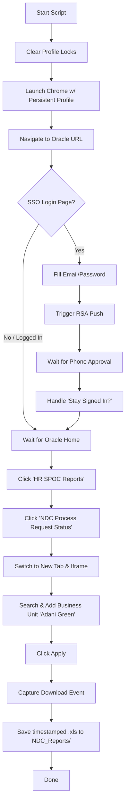

# Oracle Fusion - NDC Process Request Status Report Downloader

This project automates the extraction and download of the Oracle BI Publisher report: **`NDC Process Request Status(NDC Assigned Date)`**.

It utilizes **Playwright** in Python to handle the navigation, automate Microsoft SSO login, manage MFA/RSA push notifications, select the target Business Unit, and download the report file.

---

## Features

- **Automated Authentication**: Automatically fills email and password credentials for Microsoft SSO.
- **MFA/RSA Push Handling**: Detects MFA requests and prompts the user to approve the push notification on their phone.
- **Session Persistence**: Saves the browser session state in `chrome_automation_profile/` so that subsequent runs do not require logging in or completing MFA again until the session expires.
- **Dynamic UI Navigation**: Handles Oracle Fusion springboard, handles nested BI Publisher iFrames, searches and assigns Business Units (e.g., `Adani Green`), and triggers automated Excel downloads.
- **Smart Retries & Error Handling**: Implements retry logic for SSO pages and automatically clears Chrome lock files before starting.

---

## File Structure

```
NDC-Tracking-Automation/
├── scripts/
│   ├── download_ndc_report.py       ← Downloads report from Oracle Fusion
│   └── upload_to_sharepoint.py      ← Uploads report to SharePoint
├── scheduler/
│   ├── run_pipeline.py              ← Orchestrator: runs download → upload in sequence
│   └── setup_scheduler.ps1          ← ONE-TIME setup: registers 4 daily scheduled tasks
├── NDC_Reports/                     ← Downloaded Excel reports saved here
├── logs/                            ← All runtime logs saved here
│   ├── pipeline.log
│   ├── download_ndc_report.log
│   └── upload_to_sharepoint.log
├── chrome_automation_profile/       ← Persistent Chrome session (keeps you logged in)
├── pyproject.toml                   ← Project dependencies
├── .env                             ← Credentials (git-ignored)
└── .env.sample                      ← Credentials template
```

---

## Prerequisites

1. **Python 3.12+**
2. **Google Chrome** installed on the host machine (the script uses the official Chrome channel for automation).
3. **[uv](https://github.com/astral-sh/uv)** (recommended Python package manager) or standard `pip`.

---

## Setup & Installation

### Step 1: Configure Environment Variables
Copy `.env.sample` to a new file named `.env`:
```powershell
copy .env.sample .env
```
Open `.env` and fill in your details:
- **Oracle Fusion configuration**:
  - `ORACLE_URL`: The Oracle Fusion URL (e.g., `https://eibd.fa.em2.oraclecloud.com/fscmUI/faces/FuseWelcome`).
  - `ORACLE_EMAIL`: Your corporate login email.
  - `ORACLE_PASSWORD`: Your corporate login password.
  - `HEADLESS`: Set to `true` for background runs or `false` to watch the browser in action.
- **SharePoint configuration**:
  - `SHAREPOINT_TENANT_ID`: The SharePoint Tenant ID (e.g., `04c72f56-1848-46a2-8167-8e5d36510cbc`).
  - `SHAREPOINT_SITE_URL`: The SharePoint site URL (e.g., `https://adaniltd.sharepoint.com/sites/AGEL-Automation`).
  - `SHAREPOINT_CLIENT_ID`: App Registration Client ID with API access.
  - `SHAREPOINT_CLIENT_SECRET`: App Registration Client Secret.
  - `SHAREPOINT_TARGET_FOLDER`: Server relative folder path (e.g., `/sites/AGEL-Automation/Shared Documents/AI_AGEL/001_AI_Project/AI05_NDC_Tracker`).

### Step 2: Install Dependencies
It is highly recommended to use `uv` for package management:

```powershell
# Install project dependencies
uv sync

# Install Playwright browser binaries
uv run playwright install chromium
```

*(Optional)* If you prefer standard `pip` and `venv`:
```powershell
python -m venv .venv
.venv\Scripts\activate
pip install -r pyproject.toml
playwright install chromium
```

---

## Usage

### 1. Download the Report
Run the automation script to download the report from Oracle Fusion:

```powershell
uv run scripts/download_ndc_report.py
```

- **Headless Mode (Background)**: Set `HEADLESS=true` in `.env` to run the browser in the background.
- **Headed Mode (Visual)**: Set `HEADLESS=false` in `.env` to open the browser window and watch the interactions.

> [!NOTE]
> If a login session expires and MFA is triggered, the script will wait up to **5 minutes** for you to approve the push notification on your mobile device. Once approved, it will automatically continue.

### 2. Upload to SharePoint
Run the upload script to upload the report to SharePoint:

```powershell
# Automatically search for and upload the latest report in the NDC_Reports/ directory
uv run scripts/upload_to_sharepoint.py

# Or specify a specific file path to upload
uv run scripts/upload_to_sharepoint.py --file "./NDC_Reports/your_report_name.xls"
```

---

## Automated Scheduling

The pipeline runs automatically at **9 AM, 12 PM, 3 PM, and 6 PM** every day.
If the PC was off or asleep at trigger time, it runs immediately on the next boot/wake.

---

### ▶ Setup — Run Once Per Machine

Open **PowerShell or CMD as Administrator** and run:

```cmd
cd "C:\Projects\NDC-Tracking-Automation"
powershell -ExecutionPolicy Bypass -File scheduler\setup_scheduler.ps1
```

> [!NOTE]
> Works in **both PowerShell and CMD** — no Administrator access required.

---

### 🔍 Verify — Check Tasks Are Active

Run after setup **or after every restart** to confirm all 4 tasks are alive:

**PowerShell:**
```powershell
Get-ScheduledTask -TaskName "NDC_Pipeline_*" | Select-Object TaskName, State
```

**CMD:**
```cmd
schtasks /Query /FO TABLE | findstr "NDC_Pipeline"
```

✅ Expected output — all tasks must show `Ready`:
```
TaskName           State
NDC_Pipeline_0900  Ready
NDC_Pipeline_1200  Ready
NDC_Pipeline_1500  Ready
NDC_Pipeline_1800  Ready
```

---

### ⏸ Stop / Disable — Pause Without Deleting

Use this when you want to **temporarily stop** the pipeline (e.g. during maintenance).
Tasks remain registered — just won't fire until re-enabled.

**PowerShell:**
```powershell
Disable-ScheduledTask -TaskName "NDC_Pipeline_0900"
Disable-ScheduledTask -TaskName "NDC_Pipeline_1200"
Disable-ScheduledTask -TaskName "NDC_Pipeline_1500"
Disable-ScheduledTask -TaskName "NDC_Pipeline_1800"
```

**CMD:**
```cmd
schtasks /Change /TN "NDC_Pipeline_0900" /DISABLE
schtasks /Change /TN "NDC_Pipeline_1200" /DISABLE
schtasks /Change /TN "NDC_Pipeline_1500" /DISABLE
schtasks /Change /TN "NDC_Pipeline_1800" /DISABLE
```

---

### ▶ Re-Enable — Resume After Stopping

**PowerShell:**
```powershell
Enable-ScheduledTask -TaskName "NDC_Pipeline_0900"
Enable-ScheduledTask -TaskName "NDC_Pipeline_1200"
Enable-ScheduledTask -TaskName "NDC_Pipeline_1500"
Enable-ScheduledTask -TaskName "NDC_Pipeline_1800"
```

**CMD:**
```cmd
schtasks /Change /TN "NDC_Pipeline_0900" /ENABLE
schtasks /Change /TN "NDC_Pipeline_1200" /ENABLE
schtasks /Change /TN "NDC_Pipeline_1500" /ENABLE
schtasks /Change /TN "NDC_Pipeline_1800" /ENABLE
```

---

### 🗑 Remove — Permanently Delete Tasks

Use this to **completely unregister** all tasks from Windows.
You will need to run `setup_scheduler.ps1` again to restore them.

**PowerShell or CMD:**
```cmd
schtasks /Delete /TN "NDC_Pipeline_0900" /F
schtasks /Delete /TN "NDC_Pipeline_1200" /F
schtasks /Delete /TN "NDC_Pipeline_1500" /F
schtasks /Delete /TN "NDC_Pipeline_1800" /F
```

---

### 📋 Check Logs After a Run

```cmd
notepad logs\pipeline.log
```

---

### How Tasks Behave

| Scenario | Result |
|---|---|
| PC ON at trigger time | ✅ Runs silently at exact time |
| PC OFF/asleep at trigger time | ✅ Runs automatically on next boot/wake |
| Windows Lock Screen (`Win + L`) | ✅ Runs normally (PC is still on) |
| Sleep mode / Lid closed | ✅ Runs on wake |

> [!NOTE]
> Tasks are **permanently stored in Windows** — they survive restarts, updates, and sleep.
> Re-run `setup_scheduler.ps1` only if the project folder is moved or Windows is reinstalled.


---

## How It Works Under the Hood



1. **Clean Profile Locks**: The script cleans any leftover Chrome lock files (e.g. `SingletonLock`) to prevent browser launch issues.
2. **Persistent Context**: Uses `chrome_automation_profile/` to keep you logged in across multiple script executions.
3. **Microsoft SSO & RSA MFA**: Automates credential input and handles MFA push verification. If the login session is rejected/retried, it clicks "Retry" up to 3 times.
4. **Oracle Navigation**: Opens the report portal and handles nested iframe elements.
5. **Business Unit Selection**: Automates the modal search dialog to search for `"Adani Green"`, moves all matching search results to the selected panel, and submits the parameter dialog.
6. **Download**: Triggers and saves the report to the `NDC_Reports/` folder, naming it with a timestamp (e.g., `NDC_Process_Request_Status_18_June_2026_11.30AM.xls`).

---

## Troubleshooting

### Browser Fails to Start (Lock Files)
If the script crashed previously, Chrome might leave lock files behind. While `download_ndc_report.py` attempts to delete these automatically, you can manually delete the `chrome_automation_profile/SingletonLock` file if the browser fails to initialize.

### MFA Timeout
If you miss the push notification on your phone, the script will timeout after 5 minutes. Simply run the script again.

### Customizing the Business Unit
Currently, the Business Unit search term is set to `"Adani Green"`. To download reports for a different Business Unit, edit the `BUSINESS_UNIT_SEARCH` variable inside `download_ndc_report.py`:
```python
BUSINESS_UNIT_SEARCH = "Your Business Unit Name"
```
